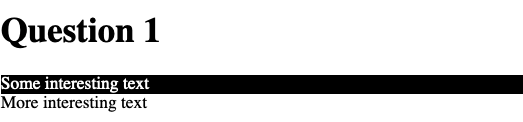
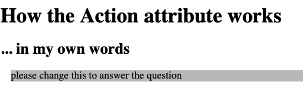
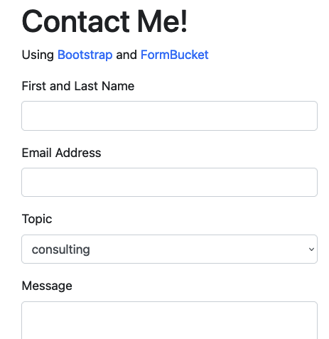
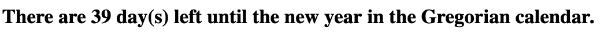
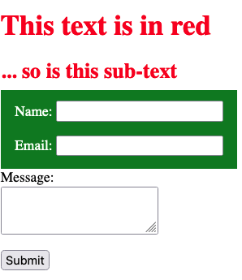

# UX220Test2
Test 2 for UX220

[Edit here](https://diy-pwa.dev/~/gh/rhildred/UX220Test2)

Each question is worth 2 points.

1. Because of a mistake, the following code colors the text in both divs. Fix the mistake so that the text is colored in only the 1st div.

2. Describe using a properly structured html document and your own words the responsibility of the action attribute of 
a form tag. Apply css formatting to change the background of the the paragraphs to silver. Keep the foreground color as black. 
Change the non-silver space around your paragraph to have a left and bottom margin equal to the height of a default character.

3. The following code is for a form in twitter boostrap. Add a field that allows the user to select a subject from 
either "support," or "consulting," choices In the correct part of the file also add html so that the page will 
display with 1:1 scale on a mobile device.

4. The following custom element logs the number of days until New Years to the console. 
Visible in the "inspect" developer tools. Finish the custom element to put the days left in to the .html

5. Add a single css rule to give labels with the class green_label a green background.
Create green space equal to the current font size around those labels.

[Edit here](https://diy-pwa.dev/~/gh/rhildred/UX220Test2)
